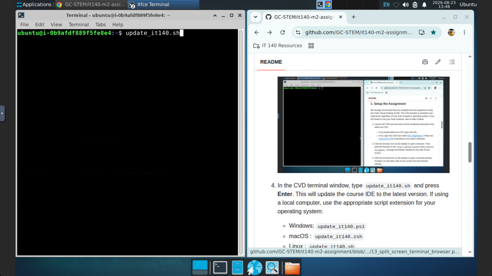
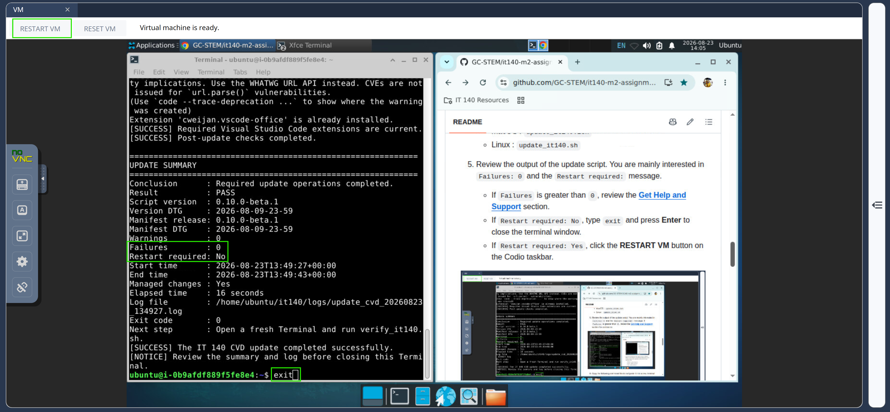
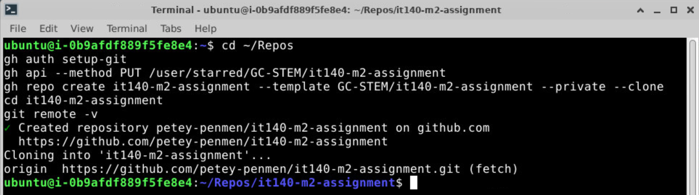
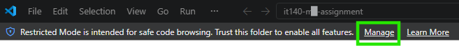
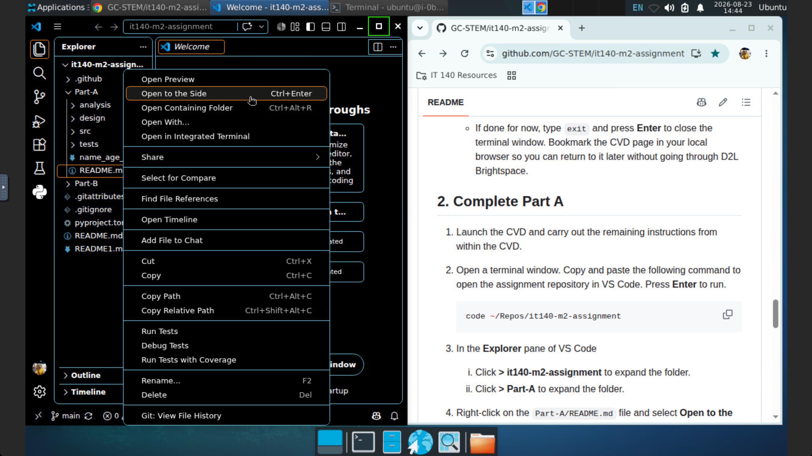
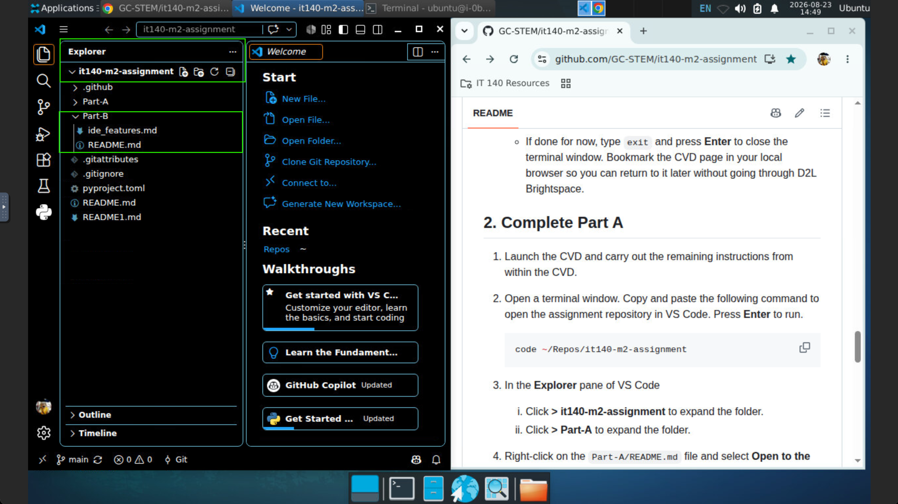
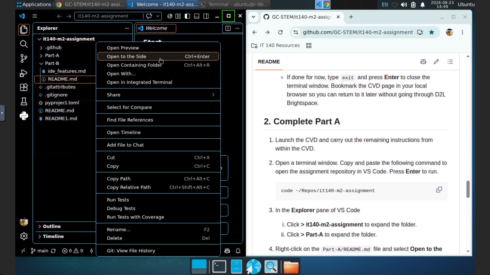

<!-- To see this file in a clean, formatted view, select ▼ in the upper-right corner of the editor pane, then select "Markdown Preview".-->

# IT 140 Module Two Assignment | Software Development Introduction

<!-- [](https://teams.microsoft.com/meet/251893230823370?p=dm9ZYMvwmK3hCoqbnt)
-->
---

> [!IMPORTANT]
>
> * 🚫 **Fork** — Do NOT fork this repo!!! Instead, follow the instructions below.
> * 🚫 **Use this template** — Do NOT click the green *Use the template* button!!! Instead, follow the instructions below.
> * ⭐ **Star** — Click to bookmark this repo, if desired.
> * 👁️ **Watch** — Click to receive notices of repo changes, if desired.
>   * **Students:** Not recommended. Watching generates unnecessary notifications.
>   * **Faculty:** Consider selecting **Watch → Custom → Releases + Issues** to receive major repository updates and follow reported issues.

---

> [!NOTE]
> **🆕 New for 2026 C-5:** IT 140 now uses GitHub repositories to provide assignment starter files, development resources, and supporting documentation.
>
> If you have a question, check [GitHub Discussions](https://github.com/GC-STEM/it140-m2-assignment/discussions) to see whether it has already been answered or ask a new question.
>
> If you find a problem with this GitHub repository or its instructions, or have a suggestion for improvement, please open [GitHub Issues](https://github.com/GC-STEM/it140-m2-assignment/issues) to review existing issues or create a new issue.

---

* **Course**: IT 140 - *Introduction to Scripting*
* **Task Title**: 2-3: Software Development Introduction
* **Task Type**: Required, graded, one submission; two graded files plus one ungraded supporting file required
* **Repository Version**: 1.0.4
* **Repository Version DTG**: 2026-09-07-12-00

---

<!-- omit from toc -->
## Table of Contents

* [0. Meet the Prerequisites](#0-meet-the-prerequisites)
* [1. Setup the Assignment](#1-setup-the-assignment)
* [2. Complete Part A](#2-complete-part-a)
* [3. Complete Part B](#3-complete-part-b)
* [4. Save Your Work to GitHub](#4-save-your-work-to-github)
* [5. Submit Your Assignment](#5-submit-your-assignment)
* [Get Help and Support](#get-help-and-support)

## 0. Meet the Prerequisites

* [ ] **Required**. To start this assignment, you must have completed the [GitHub](https://github.com/GC-STEM/it140-m1-setup-tasks/tree/main/github) and [Codio](https://github.com/GC-STEM/it140-m1-setup-tasks/tree/main/codio) sections of the [Module One Setup Tasks](https://github.com/GC-STEM/it140-m1-setup-tasks). If you have not done so, please complete those tasks now. Return here after completing those tasks.

* [ ] **Recommended**. Complete all Module One and Two zyBooks activities (Participation and Lab) in [D2L Brightspace](https://learn.snhu.edu/). These activities introduce you to the skills you will use in this assignment.

## 1. Setup the Assignment

We strongly recommend that you complete course assignments using the Codio Virtual Desktop (CVD). The CVD provides a consistent user experience regardless of your local computer's operating system. If you choose to use your local computer, start at **Step 3** below. The repository command blocks in this README use the same commands on the CVD, Linux, macOS, and Windows when Windows users run them in Git Bash.

> [!IMPORTANT]
> **Windows users:** Run all `bash` command blocks in this README in a **Git Bash** terminal. Do not use PowerShell or Command Prompt for these command blocks.

1. **CVD Only**: Launch the CVD now and carry out the remaining instructions from within the CVD.
   * If you bookmarked the CVD, open that link.
   * If not, open the CVD from within [D2L Brightspace](https://learn.snhu.edu/). Follow the [Launch the CVD](https://github.com/GC-STEM/it140-m1-setup-tasks/blob/main/codio/README.md#1-launch-the-cvd) instructions if you need a refresher.

2. **CVD Only**: Click the browser icon on the taskbar to open a browser. Point it to `https://github.com/GC-STEM/it140-m2-assignment`.
   * *Tip*. All course repositories are bookmarked in the **IT 140 Resources** folder in your CVD browser for easy access.

3. Arrange the browser window on the opposite side of your screen as your desktop icons, as shown below.

   

4. Update your system if it has been more than a week since your last update. Be patient. It may take a few minutes to complete. Updating may also require a restart.

   1. **CVD Users**: Click the terminal icon on the taskbar to open a terminal window. Type `update_it140.sh` and press **Enter**.

   2. Review the output of the update script. You are mainly interested in `Failures: 0` and the `Restart required:` message.
      * If `Failures` is greater than `0`, review the [**Get Help and Support**](#get-help-and-support) section.
      * If `Restart required: No`, type `exit` and press **Enter** to close the terminal window.
      * If `Restart required: Yes`, click the **RESTART VM** button on the Codio taskbar and wait for the CVD to restart.

      

5. Open a new terminal window and copy the following command block and paste it into the new terminal window. If prompted about a "Potentially Unsafe Paste", click the **Paste** button. Press **Enter** to run the commands. **Windows users must use a Git Bash terminal.**

   <!-- ci:command-test id=setup-personal-repo fixture=empty-repos expect=repo -->
   ```bash
   cd ~/Repos
   gh auth setup-git
   gh api --method PUT user/starred/GC-STEM/it140-m2-assignment
   gh repo create it140-m2-assignment --template GC-STEM/it140-m2-assignment --private --clone
   cd it140-m2-assignment
   git remote -v
   ```

   *Note*. The above commands only work the first time you run them successfully. If you want to update your repository later or start over, see the [**Technical Support**](#technical-support) section.

6. Review the output of the last command. You should see output similar to the what is shown below, except with your GitHub username in place of `petey-penmen`.

   

7. Determine if you want to continue to Part A now or if you want to stop and continue later.
   * If you want to continue to Part A now, type `code .` and press **Enter**. Skip to Step 3 in **2. Complete Part A**.
   * If done for now, type `exit` and press **Enter** to close the terminal window. Bookmark the CVD page in your local browser, if you have not already, so you can return to it later without going through [D2L Brightspace](https://learn.snhu.edu).

## 2. Complete Part A

1. Launch the CVD. If using the Codio Virtual Desktop (CVD), carry out the remaining instructions from within the CVD.

2. Open a terminal window (**Git Bash on Windows**). Copy and paste the following commands to open the assignment repository in VS Code. Press **Enter** to run them.

   <!-- ci:command-test id=open-part-a fixture=existing-repo expect=repo -->
   ```bash
   cd ~/Repos/it140-m2-assignment
   code .
   ```

   *Reminder*. **Path shortcuts**: In terminal commands, **`~`** means your home folder, and **`.`** means the current working directory (CWD). For example:
     * `cd ~/Repos` means change directory to the `Repos` folder inside your home folder.
     * `code .` opens the current folder in VS Code.

   >*Note*
   >
   > If you see the **Restricted Mode** warning bar:
   >
   > 
   >
   > 1. Click **Manage** on the **Restricted Mode** warning bar.
   > 2. In **Workspace Trust**, find **Trusted Folders & Workspaces**.
   > 3. Use the control in that section to add a trusted folder.
   > 4. In the folder selection window, go to your home folder and select the entire **Repos** folder.
   > 5. Confirm the folder selection and trust it when prompted.
   > 6. Verify that your **Repos** folder appears under **Trusted Folders & Workspaces**.
   >  
   > Trust the entire `~/Repos` folder rather than only `it140-m2-assignment`. VS Code applies trust to all subfolders of a trusted parent folder, including this assignment repository.
   >
   > After `~/Repos` is trusted, VS Code should leave Restricted Mode and the course extensions and workspace settings should be available normally.

3. If the **Chat** pane opens in VS Code, click the **X** in the upper right corner for that pane to close it. Do NOT click the **X** to close the entire VS Code window right above it.

   

4. In the **Explorer** pane of VS Code:
   * Click **> it140-m2-assignment** to expand the folder, if needed.
   * Click **> Part-A** to expand the folder, if needed.

   

5. Right-click on the `Part-A/README.md` file and select **Open to the Side**.

   

6. You will now follow instructions in the `Part-A/README.md` file.
   * **CVD User**. When ready, maximize the VS Code window by clicking the **Maximize** button in the upper right corner of the VS Code window. Look for the green box in the previous screenshot.

## 3. Complete Part B

1. **CVD Users**. If not already running, launch the CVD and carry out the remaining instructions from within the CVD.

2. Open a terminal window (**Git Bash on Windows**). Copy and paste the following commands to open the assignment repository in VS Code. Press **Enter** to run them.

   <!-- ci:command-test id=open-part-b fixture=existing-repo expect=repo -->
   ```bash
   cd ~/Repos/it140-m2-assignment
   code .
   ```

3. If the **Chat** pane opens in VS Code, click the **X** in the upper right corner for that pane to close it. Do NOT click the **X** to close the entire VS Code window.

   

4. In the **Explorer** pane of VS Code"
   * Click **> it140-m2-assignment** to expand the folder, if needed.
   * Click **> Part-B** to expand the folder, if needed.

   

5. Right-click on the `Part-B/README.md` file and select **Open to the Side**.

   

6. You will now follow instructions in the `Part-B/README.md` file.
   * **CVD Users**. When ready, maximize the VS Code window by clicking the **Maximize** button in the upper right corner of the VS Code window right above it. Look for the green box in the previous screenshot.

## 4. Save Your Work to GitHub

Before submitting your assignment, save your completed work to your personal GitHub repository.

Open a terminal window (**Git Bash on Windows**) and run:

<!-- ci:command-test id=save-before-submit fixture=existing-repo expect=repo -->
```bash
cd ~/Repos/it140-m2-assignment
git status
git add Part-A/name_age_sdw.md Part-A/src/name_age.py Part-B/ide_features.md
git commit -m "Complete Module Two assignment"
git push
```

These commands do the following:

* `git status` shows the current state of your local repository.
* `git add` prepares your Module Two assignment files to be saved.
* `git commit` saves a snapshot of those files in your local Git repository.
* `git push` uploads that commit to your personal GitHub repository.

> [!NOTE]
> If Git reports `nothing to commit, working tree clean`, your current files have already been committed. The `git push` command will still check whether your personal GitHub repository is up to date.

If `name_age.py` changed, pushing your work also starts the **Python program check** in GitHub Actions. This provides additional feedback about Python syntax, the provided acceptance tests, and basic code style.

To review the feedback:

1. Open your personal `it140-m2-assignment` repository on GitHub.
2. Select the **Actions** tab.
3. Open the most recent **IT 140 Checks** workflow run.
4. Open **Python program check** and review the summary.

If the Python syntax check or acceptance tests fail, return to Part A, correct the problem, test your program again, and then commit and push the corrected version.

> [!IMPORTANT]
> Saving your work to GitHub does not submit your assignment. You must still submit the required files in [D2L Brightspace](https:\\learn.snhu.edu) in the next section.

## 5. Submit Your Assignment

In your IT 140 course in [D2L Brightspace](https://learn.snhu.edu/), go to the **Course Menu** and select **Assignments**. Click on the **2-3 Assignment: Software Development Introduction** link. Follow the instructions to submit your assignment. Submit both files in Brightspace as one submission:

1. [`name_age.py`](./Part-A/src/name_age.py)

2. [`ide_features.md`](./Part-B/ide_features.md)

## Get Help and Support

### Academic Support

* For **live help** with this assignment or zyBooks activities, see [Academic Support](https://github.com/GC-STEM/it140/wiki/Course-Support).

* For **self help** with this assignment and other module concepts, see the assignment [Wiki](https://github.com/GC-STEM/it140-m2-assignment/wiki).

### Technical Support

* For **live help** with course infrastructure (Codio, zyBooks, Sense), click the **IT Service Desk** link on the menu bar in your [D2L Brightspace](https:\\learn.snhu.edu) course.

* For **self help** with course infrastructure, continue reading.

### The course IDE Update reports a failure

If Step 5 reports `Failures` greater than `0`, stop before continuing to Step 6. Follow the **Action required** and **Next step** shown in the Update summary.

If the problem is not resolved, see **[Setup Problems and Support](https://github.com/GC-STEM/it140-m1-setup-tasks/wiki/Setup-Problems-and-Support)**. That page explains what information to collect and where to ask for help with course IDE setup and lifecycle-script problems.

Before asking for help, save the exact Update summary and error message. The lifecycle scripts also save a diagnostic log under `~/it140/logs/` or the corresponding `it140/logs` folder in your user profile.

> [!WARNING]
> Do not attempt manual `sudo`, package-manager, system, or course-file repairs unless the course instructions or technical support specifically direct you to do so.

### Your Module Two assignment already exists somewhere

Your Module Two assignment will have several related copies:

* **Public course template on GitHub:** `GC-STEM/it140-m2-assignment`. This is the course-provided starting point. You cannot modify this copy.

* **Your personal GitHub repository:** `it140-m2-assignment` in your own GitHub account. This stores the work you "push" (upload) to GitHub.

* **A local clone on a device:** Usually `~/Repos/it140-m2-assignment` on the CVD or your local computer. This is the copy you open in VS Code and edit.

Step 6 creates your personal GitHub repository and then creates a local clone on the device where you run the commands.

Choose the situation below that matches what you see.

> [!IMPORTANT]
> **Windows users:** Run the `bash` command blocks in this section in **Git Bash**, not PowerShell or Command Prompt.

#### Your personal GitHub repository and local clone both exist on this device

For example, you created your personal GitHub repository while working on the CVD, and `~/Repos/it140-m2-assignment` also exists on that CVD.

Do not run the Step 6 setup commands again.

Open the local clone on your current device:

<!-- ci:command-test id=open-existing-clone fixture=existing-repo expect=repo -->
```bash
cd ~/Repos/it140-m2-assignment
code .
```

#### Your personal GitHub repository exists, but there is no local clone on this device

For example, you created your personal GitHub repository and local clone on the CVD, but now you are using your local computer for the first time.

Do **not** create another personal GitHub repository from the public course template.

Instead, create a local clone of your existing personal GitHub repository on the current device and open it in VS Code:

<!-- ci:command-test id=clone-existing-repo fixture=empty-repos expect=repo -->
```bash
cd ~/Repos
gh auth setup-git
gh repo clone "$(gh api user --jq .login)/it140-m2-assignment"
cd it140-m2-assignment
git remote -v
code .
```

#### A local clone exists on this device, but you are not sure about your personal GitHub repository

Do not delete the local clone on this device and do not run the Step 6 setup commands again. The local clone may contain assignment work that has not yet been pushed to your personal GitHub repository.

From the device that contains the local clone, run:

<!-- ci:command-test id=inspect-local-remote fixture=existing-repo expect=repo -->
```bash
cd ~/Repos/it140-m2-assignment
git remote -v
```

This shows which GitHub repository the local clone is connected to.

If you are unsure what the output means, or your expected personal GitHub repository is missing, ask for help before deleting or replacing the local clone or anything in your GitHub account.

### Working on the assignment from more than one device

> [!IMPORTANT]
> We highly recommend completing IT 140 work on just one device. Using one device helps avoid synchronization problems and merge conflicts that can occur when the same personal GitHub repository is changed from more than one device.
>
> If you are already comfortable working with Git and GitHub, you may work from more than one device. Follow the instructions below carefully to keep your copies synchronized.

A single personal GitHub repository can have a local clone on more than one device. For example:

* **First device:** Your CVD
* **Second device:** Your local computer

Before leaving the first device, save your changes in the local clone on that first device and push them to your personal GitHub repository.

A merge conflict can occur when different changes are made to the same work on two devices before those devices are synchronized. You do not need to learn how to resolve merge conflicts for this assignment. The safest approach is:

> **Before switching devices: push your work. Before starting on the other device: pull the latest work.**

**On the first device, before switching:**

<!-- ci:command-test id=save-before-switch fixture=existing-repo expect=repo -->
```bash
cd ~/Repos/it140-m2-assignment
git status
git add -A
git commit -m "Save work before switching devices"
git push
```

After moving to the second device, update the local clone on that second device from your personal GitHub repository before making any new changes.

**On the second device, before starting work:**

<!-- ci:command-test id=sync-second-device fixture=existing-repo expect=repo -->
```bash
cd ~/Repos/it140-m2-assignment
git pull --ff-only
git status
code .
```

> [!IMPORTANT]
> The second command block assumes that a local clone already exists on the second device. If there is no `~/Repos/it140-m2-assignment` folder on the second device, follow **Your personal GitHub repository exists, but there is no local clone on this device** above instead.

If `git push` or `git pull --ff-only` reports an error, **stop and do not make additional changes on either device**. Do not try other Git commands to resolve the problem. Ask for help before continuing.

### You intentionally want to start over

Starting over may involve one or more separate copies:

* Your **personal GitHub repository** in your GitHub account
* Your **local clone on your CVD**
* Your **local clone on your local computer**

Deleting one copy does not necessarily delete the others.

Before deleting or replacing anything, make sure you have saved any work you want to keep. If you have already started the assignment or are unsure which copy is safe to replace, ask for help before continuing.

For more information about these different copies, see **[Course Repositories](https://github.com/GC-STEM/it140/wiki/Course-Repositories)**.

### Other technical problems

For a current course-wide technical problem, check **[Course Status](https://github.com/GC-STEM/it140/wiki/Course-Status)**.

If you find a problem with the **public course template or its instructions**, review existing reports or open a new **[GitHub Issue](https://github.com/GC-STEM/it140-m2-assignment/issues)**.

> [!WARNING]
> Never post passwords, authentication or verification codes, recovery codes, access tokens, private identifying information, or complete solutions to graded assignments in a public GitHub issue or discussion.
